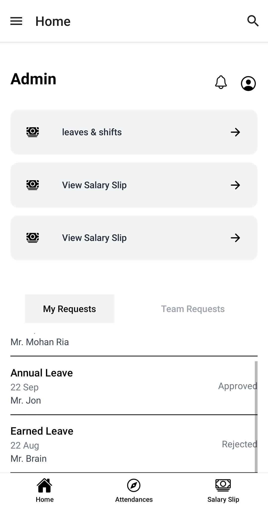
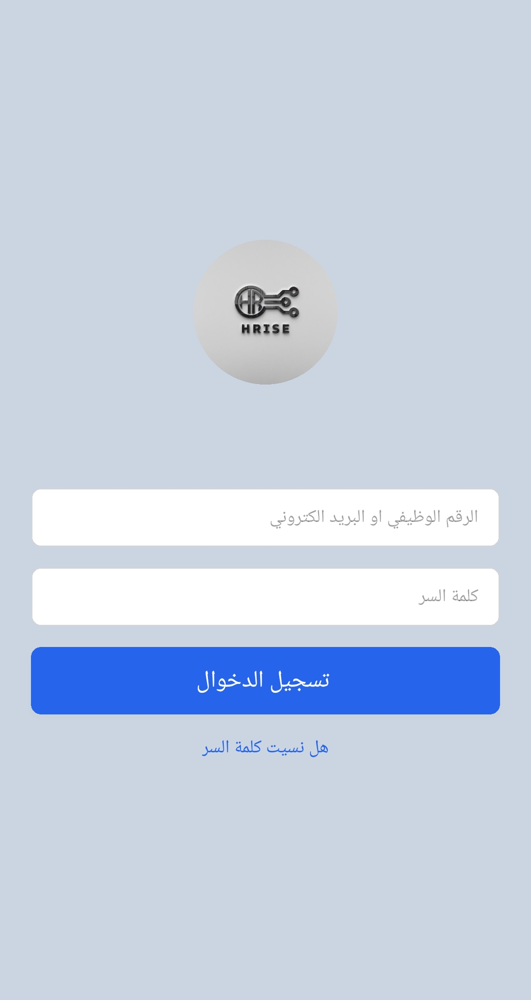
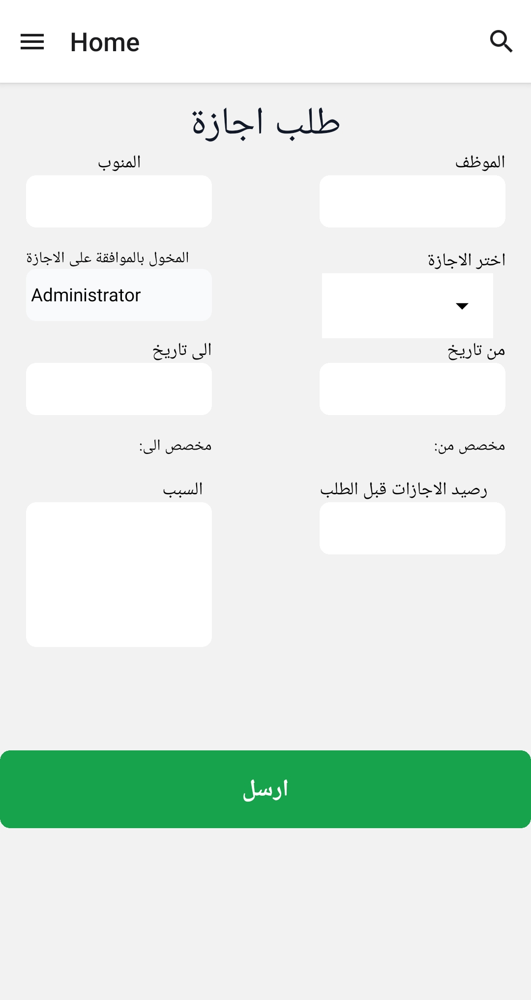
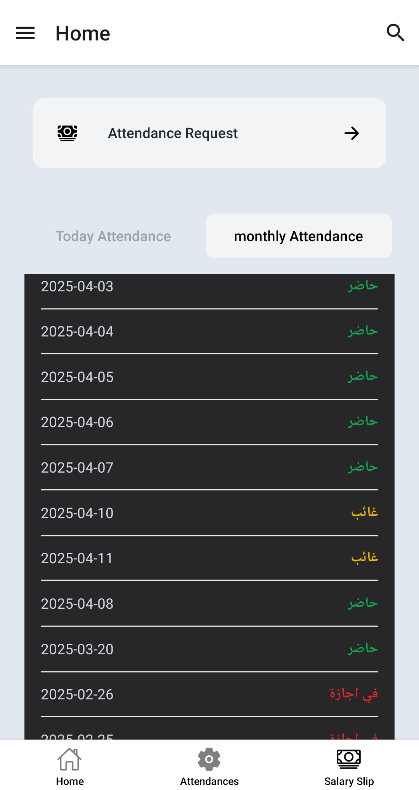

# HR React Native App linked With Frappe👋


## Requirements
before operating the app make sure that you configured this requirements

- [Android Studio ]
- [SDK Package]
- [Gradle Package]
- [Node: v18.15.0]
- [CLI:^15.1.3 ]


This is an [Expo](https://expo.dev) project created with [`create-expo-app`](https://www.npmjs.com/package/create-expo-app).

## Get started

1. Install dependencies

   ```bash
   npm install
   ```

2. Start the app

   ```bash
    npm  start --android
    ```
**There will be list of options** 

In the output, you'll find options to open the app in your android phone 

press a 
reload r

## UI Screens


## Login Screen


## Leave Request Form


## Attendances Records Screen

## Get a fresh project

When you're ready, run:

```bash
npm run reset-project
```
